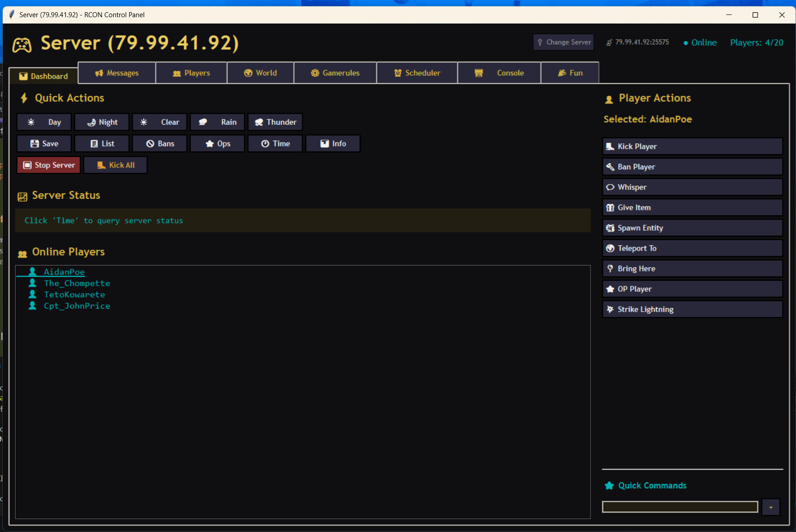

# House of Poe - Minecraft RCON Control Panel

A powerful, stylish Windows desktop application for managing your Minecraft server via RCON. Built with Python and featuring a sleek BHOP-inspired dark theme.


---

## Screenshot



---

## Features

### Login System
- Secure connection to any Minecraft server with RCON enabled
- Save credentials for quick reconnection
- Password visibility toggle (eye icon)
- Detailed connection error messages

### Quick Actions Dashboard
- **Time Control**: Set day/night/noon/midnight with one click
- **Weather Control**: Clear, rain, thunder instantly
- **Server Management**: Save world, view banned list, stop server
- **Real-time Status**: Live player count and server status

### Player Management
- Player dropdown with online players list
- **Kick/Ban/Pardon** with custom reasons
- **OP/DeOP** players
- **Give Items** with quick item buttons (diamonds, netherite, golden apples, elytra)
- **Teleport** players to other players or coordinates

### Messaging System
- Broadcast messages to all players
- Customizable prefix and colors
- Quick message buttons (Welcome, Discord link, Restart warnings)
- Color picker with Minecraft color presets

### Sound Effects
- Play sounds to specific players or all players
- Categorized sound library:
  - Scary (Wither spawn, Ghast scream, Creeper fuse)
  - Fun (Levelup, Totem, Fireworks)
  - Alerts (Anvil land, Bell, Guardian curse)
- Custom volume and pitch control

### Item Distribution
- Item search with autocomplete
- NBT data support for custom items
- Quick give buttons for popular items
- Give to specific players or everyone

### Fun Features
- ASCII art broadcasts (Creeper, Rainbow text, Fancy text)
- Fake ban/kick messages (just for fun!)
- Rainbow text generator
- Custom tellraw commands

### Punishment System
- Kick with custom reasons
- Ban with reasons
- Pardon banned players
- Whitelist management

### Scheduled Tasks
- Schedule commands to run at specific times
- One-time or recurring tasks
- Restart warnings
- Automatic world saves

### World Control
- Time presets (Dawn, Morning, Noon, Afternoon, Dusk, Night, Midnight)
- Custom time setting by ticks
- Add days to current time
- Weather control (Clear, Rain, Thunder)

### Gamerules Editor
- Visual toggle switches for boolean gamerules
- Input fields for integer gamerules
- Instant apply - changes take effect immediately
- Refresh to sync with server state

### RCON Console
- Full command-line interface
- Command history
- Quick command buttons
- Real-time output log

### Whitelist Management
- View current whitelist
- Add/remove players
- Toggle whitelist on/off

---

## Installation

### Option 1: Download the EXE (Recommended)
1. Download `RconPanelUltimate.exe` from the [Releases](../../releases) page
2. Run it - no installation needed!

### Option 2: Run from Source
```bash
# Clone the repository
git clone https://github.com/yourusername/minecraft-rcon-panel.git
cd minecraft-rcon-panel

# Install dependencies (optional, for extra features)
pip install pystray pillow plyer

# Run the application
pythonw RconPanelUltimate.pyw
```

---

## Server Setup

Make sure RCON is enabled in your `server.properties`:

```properties
enable-rcon=true
rcon.port=25575
rcon.password=your_secure_password
```

Restart your server after making changes.

---

## Theme

The application features the signature **House of Poe** aesthetic - a dark, stylish theme with:
- Dark background (`#0f0f12`)
- Gold accents (`#d6b140`)
- Cyan highlights (`#00b4b4`)
- Custom styled buttons with hover effects

---

## Built With

- **Python 3** - Core language
- **Tkinter** - GUI framework
- **Socket** - RCON protocol implementation

### Optional Dependencies
- `pystray` + `pillow` - System tray support
- `plyer` - Desktop notifications

---

## Why I Made This

I am very lazy and didn't want to learn how to make Minecraft addons or mods. So instead of spending hours learning Java or dealing with plugin development, I made this RCON panel to control everything from outside the game.

Why write code that runs inside Minecraft when you can just tell the server what to do? 

---

## License

This project is released into the public domain under [The Unlicense](LICENSE). Do whatever you want with it!

---

## Credits

**Created by House of Poe**

---

## Known Issues

- Some emoji may not display correctly on older Windows versions
- Sounds require the player to be online to hear them

---

## Support

Website: [HouseofPoe.co.uk](https://HouseofPoe.co.uk)

Discord: [discord.gg/HAtqezdy4G](https://discord.gg/HAtqezdy4G)
